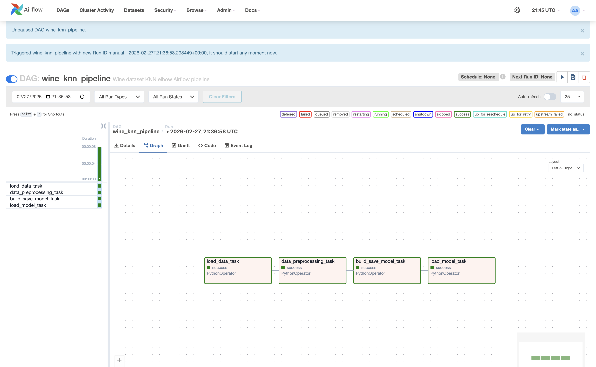
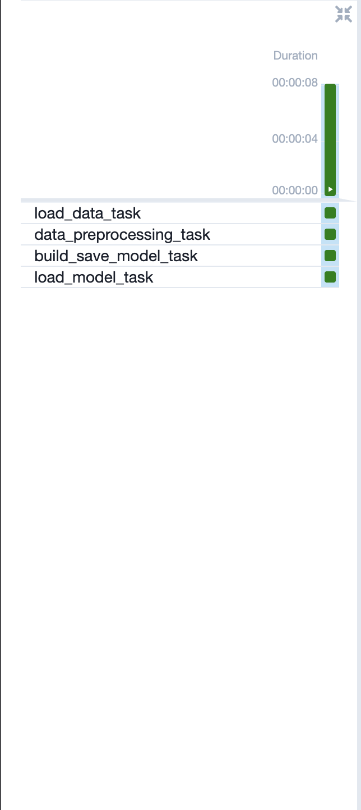

# Airflow Wine KNN Pipeline

This project demonstrates an MLOps workflow orchestrated with **Apache Airflow**. It runs a **Wine dataset** classification pipeline using **K-Nearest Neighbors (KNN)** that:

1. **load_data_task** - Loads the Wine dataset from sklearn
2. **data_preprocessing_task** - Scales features using MinMaxScaler
3. **build_save_model_task** - Trains KNN models for K=1-30, finds best K via cross-validation, saves model
4. **load_model_task** - Loads saved model, determines optimal K using elbow method, makes predictions

## Directory Structure

```
airflow_lab3/
├── docker-compose.yaml          # Airflow + Postgres + Redis + Celery services
├── .env                         # Sets AIRFLOW_IMAGE_NAME and AIRFLOW_UID
├── README.md                    # This file
├── dags/
│   ├── airflow_pipeline.py      # DAG definition (pipeline orchestration)
│   ├── src/
│   │   ├── __init__.py
│   │   └── wine_knn_functions.py  # Python functions used by tasks
│   └── model/                   # Saved model artifacts (.pkl files)
├── logs/                        # Airflow task logs
├── config/                      # Airflow configuration
└── plugins/                     # Custom Airflow plugins
```

## Prerequisites

- **Docker Desktop** installed and running
- At least **4GB memory** allocated to Docker (8GB recommended)
- **Port 8080** available on your machine

## How to Run

1. Navigate to the lab directory:
```bash
cd airflow_lab3
```

2. Initialize the Airflow database:
```bash
docker compose up airflow-init
```

3. Start all Airflow services:
```bash
docker compose up -d
```

4. Access the Airflow UI at http://localhost:8080
   - **Username:** `airflow`
   - **Password:** `airflow`

5. In the DAGs tab, find `wine_knn_pipeline` and toggle it **ON**

6. Click the **Play button** (Trigger DAG) to run the pipeline

7. Monitor task execution in the **Graph** or **Grid** view

8. When finished, stop all services:
```bash
docker compose down
```

## Pipeline Tasks

| Task | Description |
|------|-------------|
| `load_data_task` | Loads Wine dataset (178 samples, 13 features, 3 classes) |
| `data_preprocessing_task` | Drops nulls, scales features to [0,1] range |
| `build_save_model_task` | Trains KNN for K=1-30, selects best K, saves model |
| `load_model_task` | Loads model, applies elbow method, returns prediction |

## Functions (wine_knn_functions.py)

### `load_data()`
Loads the Wine dataset from sklearn and serializes it as base64 for XCom transfer.

### `data_preprocessing(data_b64)`
Deserializes data, drops null values, applies MinMaxScaler normalization.

### `build_save_model(data_b64, filename)`
Trains KNN classifiers for K values 1-30, uses 5-fold cross-validation to find optimal K, saves the best model to `dags/model/`.

### `load_model_elbow(filename, accuracies)`
Loads the saved model, uses KneeLocator to find the elbow point in accuracy curve, makes a sample prediction.

## Dataset Info

The **Wine dataset** contains chemical analysis results of wines grown in Italy from three different cultivars:

- **Samples:** 178
- **Features:** 13 (alcohol, malic acid, ash, alkalinity, magnesium, phenols, etc.)
- **Classes:** 3 wine types (class 0, 1, 2)

## Demo

### Successful DAG Run



### Task Execution Status



## Troubleshooting

**Port 8080 in use:**
```bash
# Check what's using the port
lsof -i :8080

# Or change the port in docker-compose.yaml:
# ports: - "8081:8080"
```

**Container issues:**
```bash
# Reset everything
docker compose down -v
docker compose up airflow-init
docker compose up -d
```
