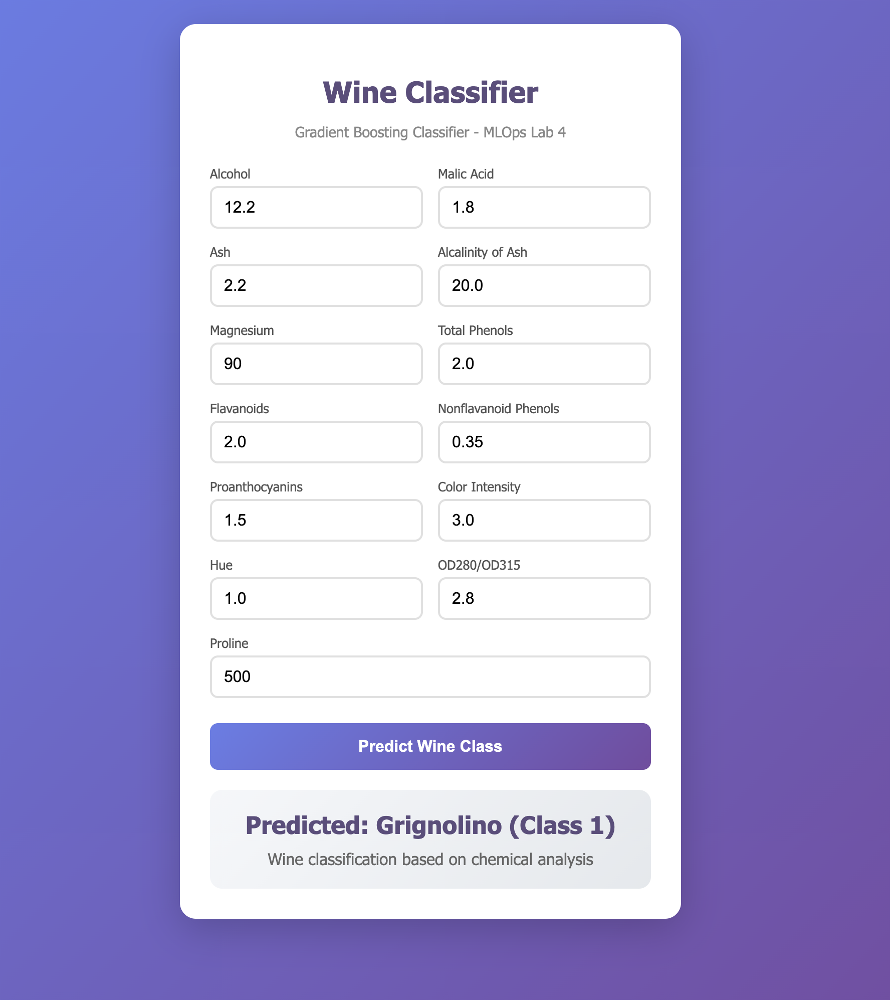

# Docker Wine Classifier

A containerized ML application using **Docker multi-stage builds** to train and serve a **Wine classification model** using **Gradient Boosting Classifier**.

## Overview

This lab demonstrates:
- **Multi-stage Docker builds** - Separate training and serving stages
- **Docker Compose** - Orchestrating multiple services with shared volumes
- **Flask API** - Serving ML predictions via REST endpoints
- **sklearn** - Gradient Boosting Classifier on Wine dataset

## Directory Structure

```
docker_lab4/
├── Dockerfile              # Multi-stage build definition
├── docker-compose.yml      # Service orchestration
├── requirements.txt        # Python dependencies
├── README.md
└── src/
    ├── model_training.py   # Model training script
    ├── main.py             # Flask application
    ├── templates/
    │   └── predict.html    # Web UI for predictions
    └── statics/            # Static assets
```

## Prerequisites

- Docker Desktop installed and running

## How to Run

### Option 1: Using Dockerfile (Multi-stage Build)

```bash
cd docker_lab4

# Build the image
docker build -t wine-classifier .

# Run the container
docker run -p 4000:4000 wine-classifier
```

### Option 2: Using Docker Compose

```bash
cd docker_lab4

# Build and run services
docker compose up

# Or run in detached mode
docker compose up -d
```

Access the application at http://localhost:4000

## API Endpoints

| Endpoint | Method | Description |
|----------|--------|-------------|
| `/` | GET | Health check - returns welcome message |
| `/predict` | GET | Web UI form for predictions |
| `/predict` | POST | API endpoint - returns JSON prediction |

## Usage

### Web Interface

1. Navigate to http://localhost:4000/predict
2. Enter the 13 wine features
3. Click "Predict Wine Class"
4. View the classification result

### API Request

```bash
curl -X POST http://localhost:4000/predict \
  -d "alcohol=13.0" \
  -d "malic_acid=2.0" \
  -d "ash=2.3" \
  -d "alcalinity_of_ash=17.0" \
  -d "magnesium=100.0" \
  -d "total_phenols=2.5" \
  -d "flavanoids=2.5" \
  -d "nonflavanoid_phenols=0.3" \
  -d "proanthocyanins=1.5" \
  -d "color_intensity=5.0" \
  -d "hue=1.0" \
  -d "od280_od315=3.0" \
  -d "proline=1000.0"
```

Response:
```json
{"predicted_class": "Barolo (Class 0)"}
```

## Wine Classes

| Class | Wine Cultivar | Description |
|-------|---------------|-------------|
| Class 0 | Barolo | Premium Italian red wine from Piedmont |
| Class 1 | Grignolino | Light red wine from Piedmont |
| Class 2 | Barbera | Popular Italian red wine variety |

## Input Features

| Feature | Description |
|---------|-------------|
| alcohol | Alcohol content |
| malic_acid | Malic acid |
| ash | Ash content |
| alcalinity_of_ash | Alcalinity of ash |
| magnesium | Magnesium |
| total_phenols | Total phenols |
| flavanoids | Flavanoids |
| nonflavanoid_phenols | Non-flavanoid phenols |
| proanthocyanins | Proanthocyanins |
| color_intensity | Color intensity |
| hue | Hue |
| od280_od315 | OD280/OD315 of diluted wines |
| proline | Proline |

## Docker Architecture

### Multi-stage Build (Dockerfile)

```
┌─────────────────────────────────────────┐
│  Stage 1: model_training                │
│  - Install dependencies                 │
│  - Train Gradient Boosting model        │
│  - Save wine_gb_model.joblib            │
└─────────────────────────────────────────┘
                    │
                    ▼
┌─────────────────────────────────────────┐
│  Stage 2: serving                       │
│  - Copy model from Stage 1              │
│  - Install Flask dependencies           │
│  - Serve predictions on port 4000       │
└─────────────────────────────────────────┘
```

### Docker Compose Architecture

```
┌──────────────────┐     ┌──────────────────┐
│  model-training  │────▶│  model_exchange  │
│  (wine_trainer)  │     │    (volume)      │
└──────────────────┘     └────────┬─────────┘
                                  │
                                  ▼
                         ┌──────────────────┐
                         │     serving      │
                         │  (wine_serving)  │
                         │   port: 4000     │
                         └──────────────────┘
```

## Demo

### Barolo (Class 0)


### Grignolino (Class 1)


### Barbera (Class 2)


## Cleanup

```bash
# Stop containers
docker compose down

# Remove volumes
docker compose down -v

# Remove built image
docker rmi wine-classifier
```
